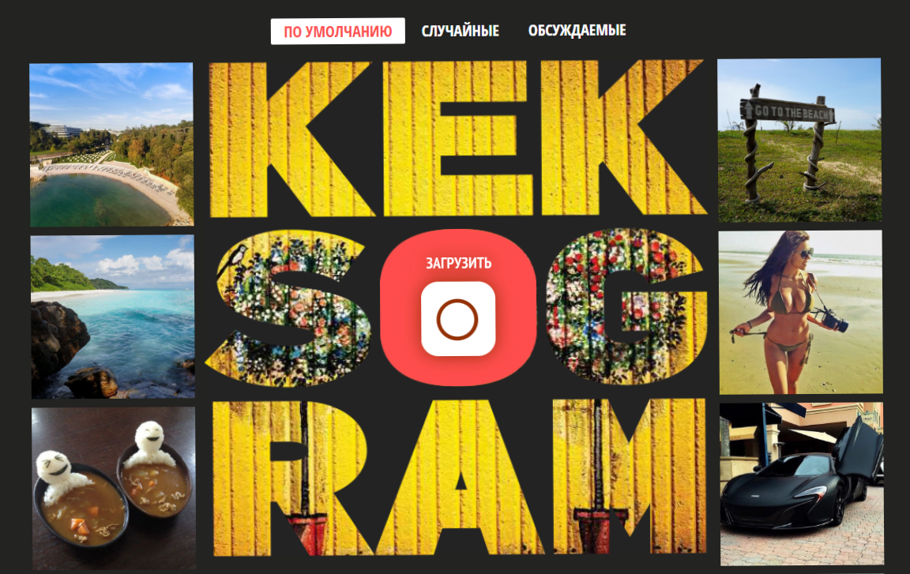
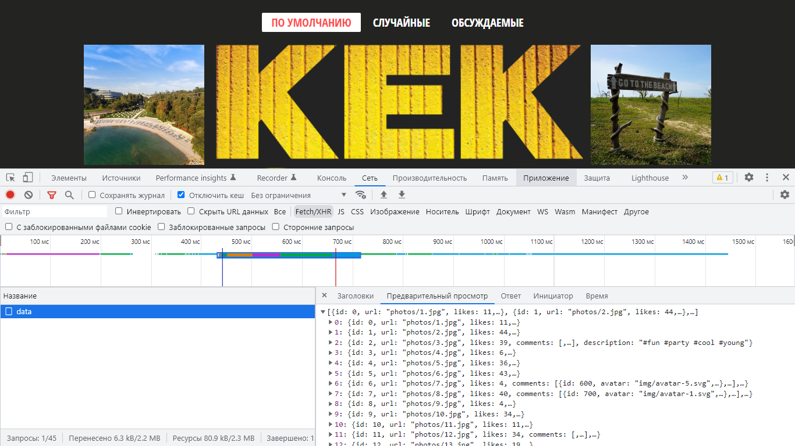
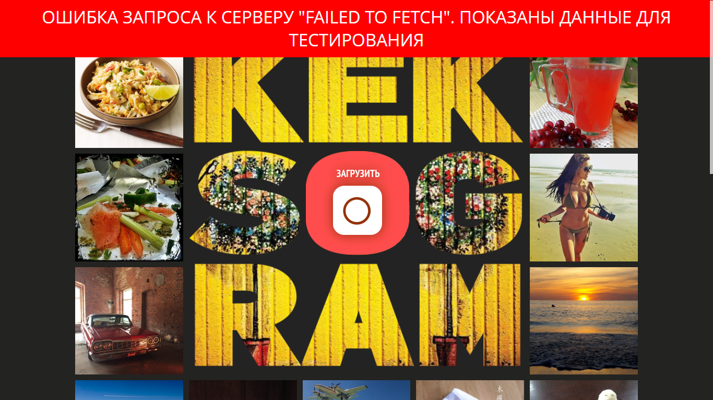
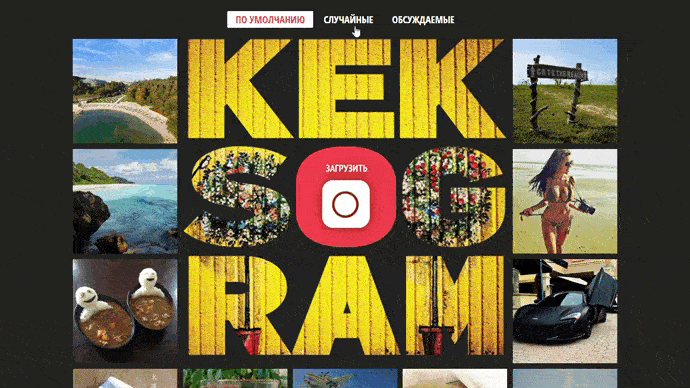
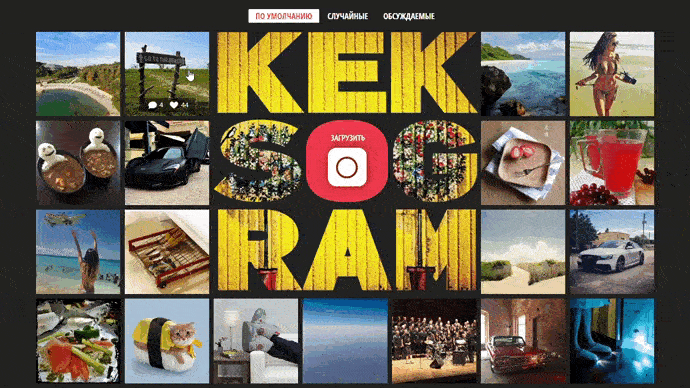
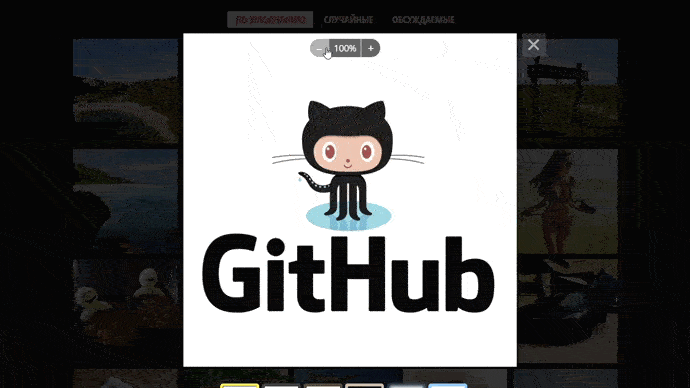
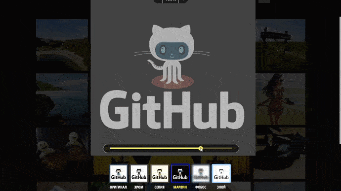
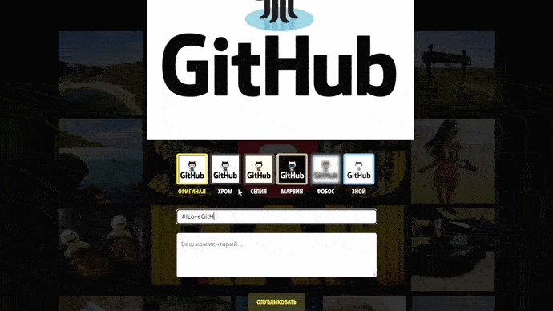
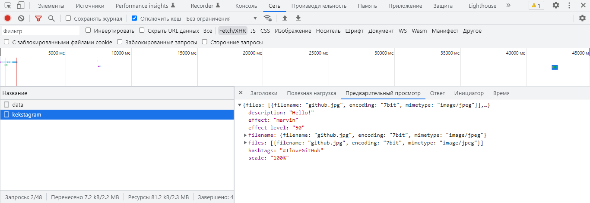

<h1 align="center">Kekstagram - image viewing service.</h1>

  
  
  

<h2>Description</h2>

Kekstagram users are given the opportunity to upload their own photos or view photos uploaded earlier by other users.

Images from other users are downloaded immediately after the page is opened from a remote server. To request data, I used Fetch API.

If a request error occurred while downloading data from the server, a warning message and temporary data are displayed.

After the successful completion of uploading all the photos, it becomes possible to filter them:

<ul>
  <li>"Default" — photos in the original order from the server;</li>
  <li>"Random" — 10 random, non-repeating photos;</li>
  <li>"Discussed" — photos sorted in descending order of the number of comments.</li>
</ul>

When you click on any of the thumbnails, a full-screen image with comments.

Uploading image is done using the standard file upload control, which is stylized as the letter "O" in the logo. After uploading the image, you can view its preview and edit it. For example:

Adjust zoom.

Apply an effect and adjust the Intensity of the effect by moving the track in the slider.

Add hash tags and comment. When you write a hash tag or comment, a validation hint appears

After filling in all the fields, data from the form, including images, is sent to the server using fetch.

<h3>About the project.</h3>

Kekstagram is my first project in which I wrote only javaScript code.
 

In this project, I used the main features of Javascript. Used built-in objects and functions. I got acquainted with the DRY principle and modules. Worked with DOM and events. I got acquainted with external APIs and third-party libraries. Interacted with the network considered the HTTP protocol, the JSON data format. I worked with asynchrony and achieved it with the help of promises. Created a simple build on webpack.

<h3>Technologies.</h3>

<ul>
  <li>JavaScript ES6+</li>
  <li>Chrome DevTools</li>
  <li>Webpack 5</li>  
</ul>

